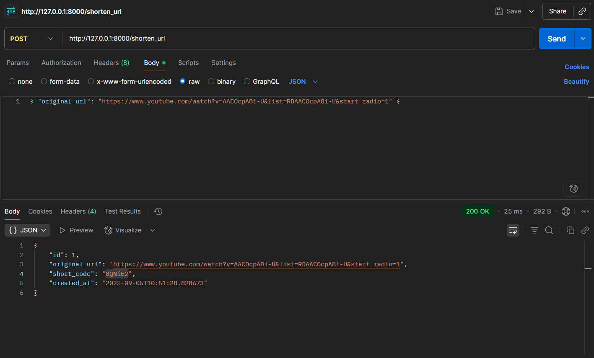
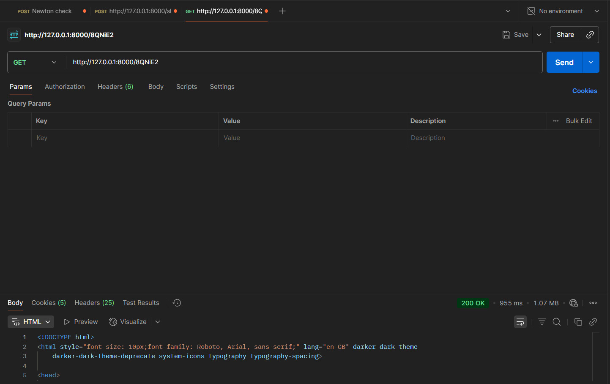

# URL Shortener

## Tech Stack Used

- **FastAPI**
- **SQLAlchemy**

## Project Structure

```text
├── app/
│   ├── __init__.py
│   ├── main.py            # FastAPI app entry point
│   ├── models.py          # SQLAlchemy models
│   ├── schemas.py         # Pydantic schemas for request/response
│   ├── crud.py            # DB operations (CRUD logic)
│   ├── database.py        # DB connection/session management
│   ├── api/
│   │   ├── __init__.py
│   │   └── routes.py      # API route definitions
│   └── utils.py           # Utility functions (e.g., code generation)
├── tests/
│   ├── __init__.py
│   └── test_main.py       # Unit/integration tests
├── alembic/               # (Optional) For DB migrations
├── requirements.txt
├── README.md
└── .env                   # Environment variables (DB URL, secrets)
```

## Postman Validation

- **Endpoint:** `http://127.0.0.1:8000/shorten_url`
- **Method:** `POST`
- **Request Body (raw JSON):**

    ```json
    {
        "original_url": "https://www.youtube.com/watch?v=AACOcpA8i-U&list=RDAACOcpA8i-U&start_radio=1"
    }
    ```

- **Sample Response:**

    ```json
    {
        "id": 1,
        "original_url": "https://www.youtube.com/watch?v=AACOcpA8i-U&list=RDAACOcpA8i-U&start_radio=1",
        "short_code": "8QNiE2",
        "created_at": "2025-09-05T10:51:28.828673"
    }
    ```



- **To test redirection:**  
    Visit: `http://127.0.0.1:8000/8QNiE2`


